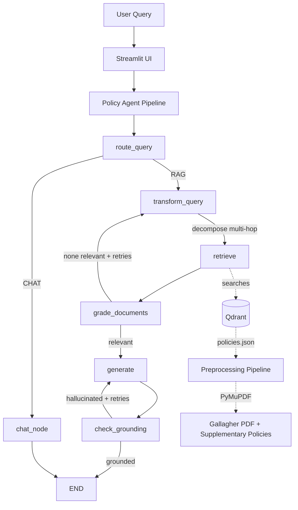

# VanaciRetain — HR Policy Assistant

An agentic Retrieval-Augmented Generation (RAG) system that answers employee questions about HR policies using a multi-step LangGraph pipeline with self-correction loops, query decomposition, and conversation memory.

Built as a portfolio project demonstrating end-to-end production ML/AI engineering: document preprocessing, vector retrieval, agentic orchestration, evaluation with RAGAS, and observability.

---

## Overview

VanaciRetain is a fictional company built around the Gallagher Franchise Solutions Employee Handbook (142 pages). The system processes the handbook into structured policy objects, indexes them in a vector database, and uses an agentic pipeline to answer employee questions with grounded citations.

The project iterates through three RAG architectures and measures each against a 50-question golden test set:

| Iteration    | Architecture                                       | Context Recall | Faithfulness |
| ------------ | -------------------------------------------------- | -------------- | ------------ |
| Baseline     | Blind 500-token chunking + similarity search       | 0.65           | 0.47         |
| Policy-Aware | Structural chunking + MMR retrieval                | 0.69           | 0.54         |
| Agentic      | LangGraph + query decomposition + corrective loops | 0.71           | 0.92         |

The evaluation revealed a fundamental limitation: single-pass retrieval cannot satisfy multi-hop questions that need information from multiple semantically distant policies. This finding motivated the LangGraph agentic pipeline with query decomposition.

---

## Architecture



### Pipeline Nodes

1. **route_query** — Classifies queries as RAG (HR policy) or CHAT (small talk). Uses small fast model for efficiency.
2. **chat_node** — Handles greetings and out-of-scope questions directly without retrieval.
3. **transform_query** — Decomposes multi-hop questions into focused sub-queries. Uses larger model for reasoning.
4. **retrieve** — Fetches documents per sub-query and deduplicates by policy + chunk index.
5. **grade_documents** — Batched LLM grader that filters out irrelevant chunks in a single call.
6. **generate** — Synthesizes answer from graded context with policy citations.
7. **check_grounding** — Hallucination check that triggers regeneration if claims are not supported by context.

The graph uses Command objects to combine state updates and routing in a single return, with conditional retry loops for retrieval failures and ungrounded generations.

### Components

* **Document Preprocessing** — Extracts structured policy objects from a 142-page PDF using PyMuPDF, with context-aware placeholder replacement, table extraction, and section detection.
* **Vector Storage** — Qdrant stores two collections: blind-chunked baseline and policy-aware versions.
* **Embeddings** — all-MiniLM-L6-v2 runs locally via sentence-transformers (no API costs).
* **LLM Manager** — Centralized configuration mapping each task to a specific model and API key. Routes evaluation traffic to a separate Groq key to avoid burning runtime quota.
* **Evaluation** — RAGAS measures context recall and faithfulness against a 60-question golden test set across 6 categories.

---

## Tech Stack

| Layer                 | Technology                             |
| --------------------- | -------------------------------------- |
| Generation Model      | Llama 3.3 70B Versatile (via Groq)     |
| Routing/Grading Model | Llama 3.1 8B Instant (via Groq)        |
| Embeddings            | all-MiniLM-L6-v2 (local)               |
| Vector Database       | Qdrant (Docker)                        |
| Agent Framework       | LangGraph + LangChain                  |
| State Management      | TypedDict with add_messages annotation |
| Structured LLM Output | Pydantic schemas with field validators |
| Document Processing   | PyMuPDF                                |
| Evaluation            | RAGAS                                  |
| UI                    | Streamlit                              |
| Package Manager       | uv                                     |
| Python                | 3.11                                   |

---

## Project Structure

```
hr-agent/
├── agents/                          # LangGraph agentic pipeline
│   ├── __init__.py
│   ├── llm_manager.py               # Centralized LLM config + API key routing
│   ├── schemas.py                   # State + structured output schemas
│   ├── nodes.py                     # Node functions with Command routing
│   └── pipeline.py                  # PolicyAgentPipeline class
│
├── api/                             # FastAPI backend (Phase 1.5)
│
├── data/
│   ├── hr_documents/
│   │   ├── raw/                     # Gallagher PDF + supplementary policies
│   │   └── processed/               # Cleaned policies.json + debug outputs
│   ├── golden_test_set/             # Evaluation Q&A pairs and results
│   │   ├── golden_test_set.json
│   │   ├── policy_aware_eval_results/
│   │   └── agentic_eval_results/
│   └── attrition_dataset/           # IBM HR data (Phase 2)
│
├── mcp/                             # MCP server tools (Phase 2)
├── mlops/                           # MLflow tracking (Phase 2)
├── models/                          # Attrition prediction models (Phase 2)
│
├── rag/                             # RAG pipeline modules
│   ├── retriever.py                 # Qdrant retrievers
│   ├── ingest_naive.py              # Blind chunking ingestion
│   ├── ingest_policy_aware.py       # Policy-aware ingestion
│   ├── baseline_rag.py              # Naive RAG chain
│   ├── policy_aware_rag.py          # Policy-aware RAG chain
│   ├── baseline_evaluation.py       # Baseline RAGAS evaluation
│   ├── policy_aware_evaluation.py   # Policy-aware RAGAS evaluation
│   └── eval_agentic.py              # Agentic LangGraph evaluation
│
├── scripts/
│   └── preprocess_handbook.py       # PDF to policy objects pipeline
│
├── tests/                           # Unit tests
│
├── outputs/                         # Generated artifacts (graph PNG)
│   └── policy_agent_graph.png       # Auto-generated agent visualization
│
├── app.py                           # Streamlit UI entry point
├── HR_AI_Copilot_VanaciRetain_Plan_v2.docx       # Original architecture doc
├── VanaciRetain_Updated_Phase_Roadmap.docx       # Phase 1.5/1.6/1.7 plan
├── docker-compose.yml               # Local Qdrant
├── pyproject.toml                   # uv dependencies
├── .python-version                  # Pinned to 3.11
├── .env.example                     # Environment variable template
├── .gitignore
└── README.md
```

---

## Setup

### Prerequisites

* Python 3.11
* Docker Desktop
* uv package manager
* Groq API key (free tier works — recommend creating two keys)

### Installation

```bash
# Clone the repository
git clone https://github.com/<your-username>/hr-agent.git
cd hr-agent

# Install dependencies
uv sync

# Copy environment template and add your API keys
cp .env.example .env
# Edit .env and add GROQ_API_KEY and GROQ_API_KEY_2

# Start Qdrant
docker compose up -d
```

### Environment Variables

Required variables in `.env`:

```
GROQ_API_KEY=your_runtime_groq_key_here
GROQ_API_KEY_2=your_evaluation_groq_key_here
QDRANT_URL=http://localhost:6333
EMBEDDING_MODEL=all-MiniLM-L6-v2
```

The two API keys are routed by task type:

* **Key 1 (GROQ_API_KEY):** Runtime queries through the Streamlit app
* **Key 2 (GROQ_API_KEY_2):** RAGAS evaluation runs only

This isolation effectively doubles your free tier quota by preventing evaluation from burning through runtime tokens.

Optional (for tracing):

```
LANGSMITH_API_KEY=your_langsmith_key
LANGSMITH_PROJECT=vanaciretain
```

---

## Running the Pipeline

The project follows a sequential build order. Each step produces a testable deliverable.

### Step 1: Preprocess the Handbook

```bash
uv run python scripts/preprocess_handbook.py
```

Downloads the Gallagher PDF, replaces template placeholders with VanaciPrime values using context-aware regex, fills blank fields with realistic policy values, ingests supplementary policies, and extracts 128 structured policy objects to `data/hr_documents/processed/policies.json`.

### Step 2: Ingest into Qdrant

Naive baseline (blind 500-token chunks):

```bash
uv run python -m rag.ingest_naive
```

Policy-aware (structural chunking with metadata):

```bash
uv run python -m rag.ingest_policy_aware
```

### Step 3: Test Interactively

Streamlit UI with the full LangGraph agentic pipeline:

```bash
streamlit run app.py
```

Open `http://localhost:8501`. The agent supports multi-turn conversation with thread-based memory, multi-hop query decomposition, and live agent flow logging in the terminal.

### Step 4: Run Evaluations

Evaluate each pipeline against the golden test set in batches of 10 (to stay under Groq rate limits):

```bash
# Baseline evaluation (naive RAG)
uv run python -m rag.baseline_evaluation

# Policy-aware evaluation (MMR retrieval)
uv run python -m rag.policy_aware_evaluation

# Agentic evaluation (LangGraph pipeline)
uv run python -m rag.eval_agentic
```

Set `EVAL_START` and `EVAL_END` at the top of each script to control which batch runs (0-10, 10-20, etc.). Results are saved as JSON in `data/golden_test_set/`.

---

## Development Phases

### Phase 1 — HR Policy Assistant (current)

* [X] Document preprocessing with PyMuPDF (128 policy objects)
* [X] Context-aware placeholder replacement (handles brackets, parentheses, blank underscores)
* [X] Supplementary policies system for content gaps in source handbook
* [X] Naive RAG baseline with blind chunking
* [X] Policy-aware RAG with structural chunking and MMR
* [X] Cross-encoder re-ranking (evaluated, removed from production path)
* [X] Golden test set with 60 Q&A pairs across 6 categories
* [X] RAGAS evaluation framework (context recall + faithfulness)
* [X] LangGraph agentic pipeline with query decomposition
* [X] Multi-LLM routing (small for grading, large for generation)
* [X] Centralized LLM manager with dual API key isolation
* [X] Streamlit UI with conversation memory
* [X] Full agentic evaluation across all 5 batches
* [X] LangSmith tracing integration
* [X] FastAPI backend with streaming
* [ ] AWS EC2 deployment

### Phase 1.5 — Production Hardening (planned)

See `VanaciRetain_Updated_Phase_Roadmap.docx` for detailed sub-phases:

* [X] LangSmith tracing + per-node latency tracking
* [X] Input/output guardrails (rate limiting, PII redaction, prompt injection detection)
* [X] Redis response caching
* [ ] AWS Bedrock vs Groq comparison evaluation
* [X] FastAPI REST backend with streaming endpoints

### Phase 1.6 — Cloud Deployment

* [ ] LocalStack-based development setup
* [ ] AWS EC2 deployment with HTTPS
* [ ] CI/CD pipeline with golden test set as quality gate

### Phase 1.7 — Showcase

* [ ] Slack bot integration
* [ ] DeepEval cross-validation (optional)

### Phase 2 — Attrition Risk Analysis

* [ ] IBM HR Analytics dataset training
* [ ] AutoGluon and XGBoost models
* [ ] MLflow experiment tracking
* [ ] Analytics Agent integration

### Phase 3 — Retention Recommendations

* [ ] Combine ML predictions with policy retrieval
* [ ] Recommendation engine
* [ ] MCP server with workflow tools

---

## Evaluation Strategy

The golden test set contains 60 questions across six categories to stress-test different RAG capabilities:

| Category     | Count | Tests                              |
| ------------ | ----- | ---------------------------------- |
| Factual      | 15    | Basic retrieval accuracy           |
| Procedural   | 12    | Multi-step extraction              |
| Comparison   | 8     | Cross-section retrieval            |
| Multi-hop    | 8     | Reasoning across multiple policies |
| Conditional  | 7     | Nuanced conditional extraction     |
| Out-of-scope | 10    | Appropriate refusal                |

Per-category analysis revealed that single-pass retrieval has a fundamental limitation on multi-hop questions: vector similarity rewards closeness to one topic, so retrieval cannot satisfy questions requiring information from multiple semantically distant policies. This finding motivated the LangGraph pipeline with query decomposition that splits multi-hop questions into focused sub-queries before retrieval.

---

## Key Engineering Decisions

**PyMuPDF over LangChain wrappers** — Direct PyMuPDF gives access to font-size-based heading detection, table extraction, and per-page filtering that the LangChain wrapper hides. Used for extraction only; LangChain handles chunking, embedding, and storage.

**Context-aware placeholder replacement** — The Gallagher handbook uses inconsistent placeholder formats (`[insert number]`, `(insert amount here)`, blank underscores). Built a multi-stage replacement pipeline that handles all three formats with regex patterns that match the surrounding context, not just the placeholder text. This prevented silent data corruption where the same placeholder needed different values in different contexts.

**Supplementary policies system** — Some questions in the golden test set (like "what is the probationary period?") could not be answered from the source handbook because the content did not exist. Built an ingestion path for manually-written supplementary policies that fill content gaps. This is realistic — production HR systems always supplement base templates with company-specific additions.

**Policy objects over blind chunks** — Instead of cutting the document into arbitrary 500-token pieces, the preprocessing pipeline extracts complete policy units with section, category, and keyword metadata. Short policies are embedded whole; long policies are chunked but each chunk inherits the parent policy metadata.

**Two LLMs for cost optimization** — Llama 3.3 70B handles generation and query decomposition (where reasoning matters). Llama 3.1 8B Instant handles routing, grading, and grounding checks (where speed matters). Centralized in `agents/llm_manager.py` so models can be swapped without touching node code.

**Dual API key isolation** — Two Groq API keys are routed by task type. Runtime traffic uses Key 1, RAGAS evaluation uses Key 2. This isolation prevents evaluation runs from burning through the runtime quota and effectively doubles the free tier limit.

**Batched document grading** — The grader sends all retrieved documents to the LLM in a single call instead of N calls, reducing the LangGraph pipeline cost from 9 LLM calls to 5 per query. With a safety net that keeps all docs if the grader rejects everything (which usually indicates grader malfunction, not actually irrelevant docs).

**Command-based routing in nodes** — Instead of separate conditional edge functions, each node returns a Command(update=..., goto=...) object that combines state changes and routing in one place. Cleaner than the conditional edges pattern because the routing logic lives next to the state update that determines it.

**Cross-encoder re-ranking measured and removed from production path** — FlashRank re-ranking added approximately 200ms per query for marginal context recall improvement (+0.08) with no faithfulness gain. Kept in `retriever.py` as reference but disabled by default.

**TypedDict over Pydantic for agent state** — TypedDict has lower overhead for partial state updates that happen between every node. Pydantic is reserved for the LLM input/output boundary where validation actually matters (parsing untrusted LLM output via with_structured_output).

---

## Observability with LangSmith

The agentic pipeline is fully instrumented with LangSmith for distributed tracing, evaluation tracking, and user feedback collection. Every query through the system generates a complete trace showing each LangGraph node's input, output, latency, and token usage — making it possible to diagnose failures at the node level instead of guessing from terminal logs.

### What's traced

Every agent invocation captures:

- Per-node latency for all 7 LangGraph nodes (route, transform, retrieve, grade, generate, check_grounding, chat)
- Token usage per node, broken down by input and output tokens
- Full state transitions between nodes with the actual document content
- Routing decisions (which conditional edge fired and why)
- Errors and retry attempts with full stack traces
- Metadata tags for filtering by question category, difficulty, and evaluation batch

### Evaluation integration

Two complementary evaluation paths feed into LangSmith:

1. **Batch evaluation** (`rag/eval_agentic.py`) runs the full golden test set in batches of 10, scores with RAGAS (context_recall, faithfulness), and pushes per-question scores back to the original LangGraph traces as feedback. Used for tracking iteration-over-iteration progress against the baseline and policy-aware versions.
2. **Deep-dive evaluation** (`scripts/eval_langsmith.py`) runs a smaller batch (4 questions) with three RAGAS metrics — context_recall, context_precision, and faithfulness — and attaches them to LangSmith traces. The fourth standard RAGAS metric (answer_relevancy) was excluded because it requires the LLM provider to support generating multiple completions per request, which Groq does not. Rather than introducing OpenAI as a second provider for one metric, the project uses context_precision and faithfulness as proxies for answer quality.

After running either script, individual traces in the LangSmith UI show the question, the agent's full execution flow, the retrieved documents, the generated answer, and all attached RAGAS scores in one place. Filtering traces by `feedback.context_recall < 0.6` instantly surfaces the worst-performing queries for investigation.

### User feedback collection

The Streamlit UI captures user thumbs up/down on every assistant response. Each feedback action pushes a `user_rating` entry to LangSmith attached to that specific run ID. This builds a real production feedback loop where bad answers can be investigated alongside their full agent traces and RAGAS scores.

### Configuration

LangSmith integration requires three environment variables in `.env`:
LANGSMITH_API_KEY=lsv2_pt_xxxxx
LANGSMITH_TRACING=true
LANGSMITH_PROJECT=hragent

When these are set, every agent run is automatically traced. When they're absent, the pipeline runs normally without tracing — making LangSmith a true observability layer rather than a hard dependency.

### Why LangSmith over local logging

The print statements in each LangGraph node provide a quick view of agent flow during development, but they don't scale once the system is deployed. LangSmith provides three things print statements cannot: persistent trace history (debug yesterday's failures, not just today's), per-node aggregated metrics (find which node is consistently slowest across all runs), and feedback correlation (link RAGAS scores or user ratings to specific traces for diagnosis). All of this fits within the free tier (5,000 traces per month), which is more than sufficient for portfolio development and demo traffic.

## Lessons Learned

1. **Data quality matters more than model quality** — The biggest accuracy improvements came from fixing preprocessing bugs (context-aware placeholder replacement) and adding supplementary content for gaps in the source handbook. The agent was correctly answering "I do not know" when the data did not have the answer.
2. **Single-pass retrieval has architectural limits** — Three iterations of retrieval improvements (better chunking, MMR, re-ranking) only moved context recall from 0.55 to 0.69. Multi-hop questions actually got worse with better chunking because vector similarity rewards topical concentration. The fix was query decomposition in LangGraph, not better retrieval.
3. **Refusal is correct behavior** — A well-behaved RAG system should say "I do not have enough information" when context is insufficient, not hallucinate. Building grounding checks and refusal pattern detection is essential for trustworthy answers.
4. **LLM token budgets force architectural decisions** — Hitting Groq rate limits during evaluation drove the decision to use two LLMs (small for support tasks, large for generation), batch the document grader, route evaluation through a separate API key, and add response caching. These optimizations have real production value beyond cost savings.

---

## Acknowledgments

* Gallagher Franchise Solutions for the public employee handbook template
* Anthropic, Groq, Qdrant, and LangChain teams for the open ecosystem
* IBM HR Analytics dataset (Phase 2) from Kaggle

---

## License

MIT
