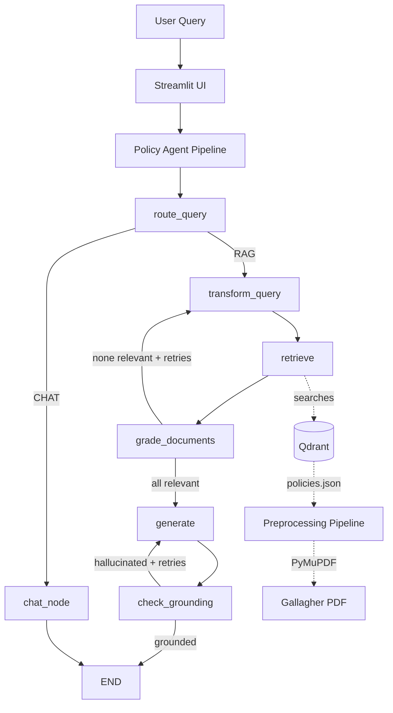

# VanaciRetain — HR Policy Assistant

An agentic Retrieval-Augmented Generation (RAG) system that answers employee questions about HR policies using a multi-step LangGraph pipeline with self-correction loops.

Built as a portfolio project demonstrating end-to-end production ML/AI engineering: document preprocessing, vector retrieval, agentic orchestration, evaluation with RAGAS, and observability.

---

## Overview

VanaciRetain is a Employee Handbook (142 pages) HR copilot. The system processes the handbook into structured policy objects, indexes them in a vector database, and uses an agentic pipeline to answer employee questions with grounded citations.

The project iterates through three RAG architectures and measures each against a 60-question golden test set:

| Iteration             | Architecture                                          | Context Recall | Faithfulness |
| --------------------- | ----------------------------------------------------- | -------------- | ------------ |
| Baseline              | Blind chunking + similarity search                    | 0.55           | 0.63         |
| Policy-Aware          | Structural chunking + MMR retrieval                   | 0.69           | 0.54         |
| Agentic (in progress) | LangGraph with query decomposition + corrective loops | TBD            | TBD          |

---

## Architecture



### Components

* **Document Preprocessing** — Extracts structured policy objects from a 142-page PDF using PyMuPDF, with placeholder replacement, table extraction, and section detection.
* **Vector Storage** — Qdrant stores two collections: blind-chunked baseline (`hr_naive`) and policy-aware (`hr_policy_aware`).
* **Embeddings** — `all-MiniLM-L6-v2` runs locally via sentence-transformers (no API costs).
* **LangGraph Agent** — Multi-node pipeline with query routing, decomposition for multi-hop questions, document grading, generation, and grounding checks.
* **Evaluation** — RAGAS measures context recall and faithfulness against a 60-question golden test set with 6 categories (factual, procedural, comparison, multi-hop, conditional, out-of-scope).

---

## Tech Stack

| Layer               | Technology                                      |
| ------------------- | ----------------------------------------------- |
| LLM Inference       | Groq API (Llama 3.1 70B / Llama 3.1 8B Instant) |
| Embeddings          | all-MiniLM-L6-v2 (sentence-transformers, local) |
| Vector Database     | Qdrant (self-hosted via Docker)                 |
| Agent Framework     | LangGraph + LangChain                           |
| Document Processing | PyMuPDF (direct extraction)                     |
| Evaluation          | RAGAS                                           |
| UI                  | Streamlit                                       |
| Package Manager     | uv                                              |
| Python              | 3.11                                            |

---

## Project Structure

```
hr-agent/
├── agents/                     # LangGraph agentic pipeline
│   ├── schemas.py              # State and structured output schemas
│   ├── nodes.py                # Node functions
│   ├── pipeline.py             # PolicyAgentPipeline class
│   └── app.py                  # Streamlit UI
│
├── api/                        # FastAPI backend (planned)
│
├── data/
│   ├── hr_documents/
│   │   ├── raw/                # Original Gallagher PDF
│   │   └── processed/          # Cleaned policies.json + debug outputs
│   ├── golden_test_set/        # Evaluation Q&A pairs and results
│   └── attrition_dataset/      # IBM HR data (Phase 2)
│
├── mcp/                        # MCP server tools (Phase 2)
├── mlops/                      # MLflow tracking (Phase 2)
├── models/                     # Attrition prediction models (Phase 2)
│
├── rag/                        # RAG pipeline modules
│   ├── retriever.py            # Qdrant retrievers (similarity, MMR, rerank)
│   ├── ingest_naive.py         # Blind chunking ingestion
│   ├── ingest_policy_aware.py  # Policy-aware ingestion
│   ├── baseline_rag.py         # Naive RAG chain
│   ├── policy_aware_rag.py     # Policy-aware RAG chain
│   ├── baseline_evaluation.py  # Baseline RAGAS evaluation
│   └── policy_aware_evaluation.py
│
├── scripts/
│   └── preprocess_handbook.py  # PDF to policy objects pipeline
│
├── tests/                      # Unit tests
│
├── outputs/                    # Generated artifacts (graph PNG, etc.)
├── deployment/                 # Docker and AWS deployment configs
│
├── HR_AI_Copilot_VanaciRetain_Plan_v2.docx  # Architecture document
├── docker-compose.yml          # Local Qdrant
├── pyproject.toml              # uv dependencies
├── .python-version             # Pinned to 3.11
├── .env.example                # Environment variable template
└── README.md
```

---

## Setup

### Prerequisites

* Python 3.11
* Docker Desktop
* uv package manager
* Groq API key (free tier works)

### Installation

```bash
# Clone the repository
git clone https://github.com/<your-username>/hr-agent.git
cd hr-agent

# Install dependencies
uv sync

# Copy environment template and add your API keys
cp .env.example .env
# Edit .env and add GROQ_API_KEY

# Start Qdrant
docker compose up -d
```

### Environment Variables

Required variables in `.env`:

```
GROQ_API_KEY=your_groq_key_here
QDRANT_URL=http://localhost:6333
EMBEDDING_MODEL=all-MiniLM-L6-v2
LLM_MODEL=llama-3.1-70b-versatile
```

Optional (for tracing):

```
LANGSMITH_API_KEY=your_langsmith_key
LANGSMITH_PROJECT=vanaciretain
```

---

## Running the Pipeline

The project follows a sequential build order. Each step produces a testable deliverable.

### Step 1: Preprocess the Handbook

```bash
uv run python scripts/preprocess_handbook.py
```

Downloads the Gallagher PDF, replaces template placeholders with VanaciPrime values, extracts 127 structured policy objects, and saves to `data/hr_documents/processed/policies.json`.

### Step 2: Ingest into Qdrant

Naive baseline (blind 500-token chunks):

```bash
uv run python -m rag.ingest_naive
```

Policy-aware (structural chunking with metadata):

```bash
uv run python -m rag.ingest_policy_aware
```

### Step 3: Test Interactively

Streamlit UI:

```bash
uv run streamlit run agents/app.py
```

Open `http://localhost:8501`. The agent supports multi-turn conversation with thread-based memory.

### Step 4: Run Evaluation

```bash
# Baseline evaluation
uv run python -m rag.baseline_evaluation

# Policy-aware evaluation
uv run python -m rag.policy_aware_evaluation
```

Evaluations run in batches of 10 questions to stay within Groq's free tier rate limits. Results are saved as JSON in `data/golden_test_set/`.

---

## Development Phases

### Phase 1 — HR Policy Assistant (current)

* [X] Document preprocessing (Gallagher handbook to 127 policy objects)
* [X] Naive RAG baseline with blind chunking
* [X] Policy-aware RAG with structural chunking and MMR
* [X] Cross-encoder re-ranking (evaluated, kept in codebase as reference)
* [X] Golden test set with 60 Q&A pairs across 6 categories
* [X] RAGAS evaluation (context recall, faithfulness)
* [ ] LangGraph agentic pipeline with query decomposition
* [ ] Streamlit UI with conversation memory
* [ ] LangSmith tracing
* [ ] FastAPI backend
* [ ] AWS deployment

### Phase 2 — Attrition Risk Analysis

* [ ] IBM HR Analytics dataset training
* [ ] AutoGluon and XGBoost models
* [ ] MLflow experiment tracking
* [ ] Inference API endpoint
* [ ] Analytics Agent integration

### Phase 3 — Retention Recommendations

* [ ] Combine ML predictions with policy retrieval
* [ ] Recommendation engine
* [ ] Full multi-agent system
* [ ] MCP server with workflow tools

---

## Evaluation Strategy

The golden test set contains 60 questions across six categories to stress-test different RAG capabilities:

| Category     | Count | Tests                              |
| ------------ | ----- | ---------------------------------- |
| Factual      | 15    | Basic retrieval accuracy           |
| Procedural   | 12    | Multi-step extraction              |
| Comparison   | 8     | Cross-section retrieval            |
| Multi-hop    | 8     | Reasoning across multiple policies |
| Conditional  | 7     | Nuanced conditional extraction     |
| Out-of-scope | 10    | Appropriate refusal                |

Per-category analysis revealed that single-pass retrieval has a fundamental limitation on multi-hop questions: vector similarity rewards closeness to one topic, so retrieval cannot satisfy questions requiring information from multiple semantically distant policies. This finding motivated the LangGraph pipeline with query decomposition.

---

## Key Engineering Decisions

**PyMuPDF over LangChain wrappers** — Direct PyMuPDF gives access to font-size-based heading detection, table extraction, and per-page filtering that the LangChain wrapper hides. Used for extraction only; LangChain handles chunking, embedding, and storage.

**Policy objects over blind chunks** — Instead of cutting the document into arbitrary 500-token pieces, the preprocessing pipeline extracts complete policy units with section, category, and keyword metadata. Short policies are embedded whole; long policies are chunked but each chunk inherits the parent policy's metadata.

**Two LLMs for cost optimization** — Llama 3.1 70B handles generation and query decomposition (where reasoning matters). Llama 3.1 8B Instant handles routing, grading, and grounding checks (where speed matters). This cuts pipeline cost by approximately 70% with minimal quality impact.

**Batched document grading** — The grader sends all retrieved documents to the LLM in a single call instead of N calls, reducing the LangGraph pipeline cost from 9 LLM calls to 5 per query.

**Cross-encoder re-ranking measured and removed from production path** — FlashRank re-ranking added ~200ms per query for marginal context recall improvement (+0.08) with no faithfulness gain. Kept in `retriever.py` as reference but disabled by default.

---

## Acknowledgments

* Gallagher Franchise Solutions for the public employee handbook template
* Anthropic, Groq, Qdrant, and LangChain teams for the open ecosystem
* IBM HR Analytics dataset (Phase 2) from Kaggle

---

## License

MIT
