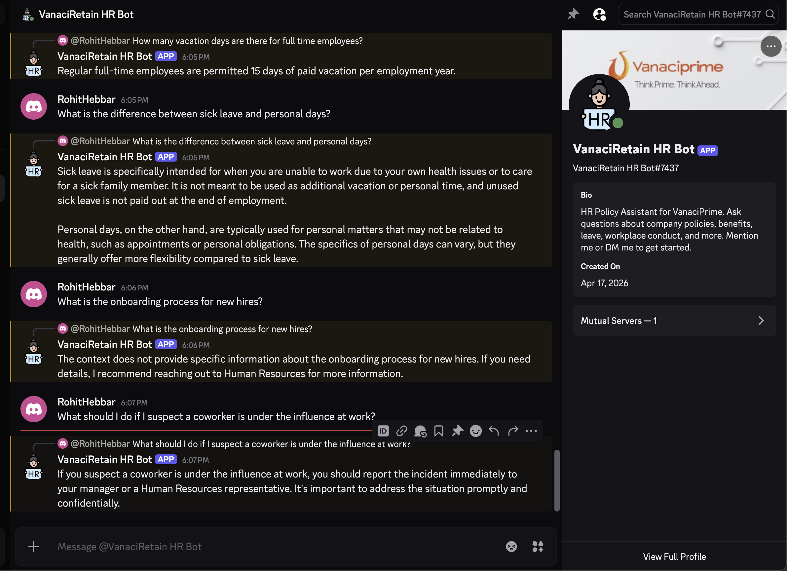
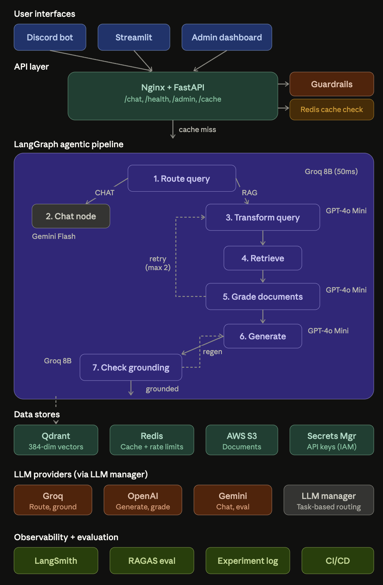

# HR copilot Assistant

An agentic Retrieval-Augmented Generation (RAG) system that answers employee questions about HR policies using a multi-step LangGraph pipeline with self-correction loops, query decomposition, and conversation memory. Deployed on AWS EC2 with Docker, integrated with Discord for real-time employee interaction.

Built as a production-grade AI engineering project demonstrating the full LLMOps lifecycle: document preprocessing, vector retrieval, agentic orchestration, evaluation with RAGAS, observability with LangSmith, guardrails, caching, and cloud deployment.

---

## Live Demo

The system is deployed on AWS EC2 and accessible via Discord bot. Employees mention the bot in any channel to start a private conversation about HR policies.



---

## Evaluation Results

Three RAG architectures evaluated against a 60-question golden test set:

| Iteration         | Architecture                                                 | Retrieval Accuracy | Answer Reliability | Hallucination Rate |
| ----------------- | ------------------------------------------------------------ | ------------------ | ------------------ | ------------------ |
| Baseline          | Blind 500-token chunking + similarity search                 | 65%                | 47%                | 53%                |
| Policy-Aware      | Structural chunking + MMR retrieval                          | 69%                | 54%                | 46%                |
| **Agentic** | **LangGraph + query decomposition + corrective loops** | **71%**      | **92%**      | **8%**       |

The agentic pipeline reduced hallucinations by 85% compared to baseline (from 53% to 8%) while improving retrieval accuracy by 9%. Answer reliability nearly doubled from 47% to 92%.

---

## Architecture


### Pipeline Nodes

1. **Route Query** — Classifies queries as RAG (HR policy) or CHAT (small talk). Uses Groq Llama 3.1 8B for fast classification.
2. **Chat Node** — Handles greetings and out-of-scope questions directly. Uses Gemini Flash for cost efficiency.
3. **Transform Query** — Decomposes multi-hop questions into focused sub-queries. Uses GPT-4o Mini for reasoning quality.
4. **Retrieve** — Fetches documents per sub-query from Qdrant and deduplicates by policy + chunk index.
5. **Grade Documents** — Batched LLM grader that filters irrelevant chunks in a single call with safety net.
6. **Generate** — Synthesizes grounded answer from context with policy citations.
7. **Check Grounding** — Hallucination check that triggers regeneration if claims are unsupported.

---

## Tech Stack

| Layer               | Technology                        |
| ------------------- | --------------------------------- |
| Generation          | OpenAI GPT-4o Mini                |
| Routing/Grounding   | Groq Llama 3.1 8B Instant         |
| Chat                | Google Gemini 2.0 Flash           |
| Evaluation          | Google Gemini 2.0 Flash           |
| Embeddings          | all-MiniLM-L6-v2 (local, CPU)     |
| Vector Database     | Qdrant (Docker)                   |
| Cache + Rate Limits | Redis                             |
| Agent Framework     | LangGraph + LangChain             |
| Backend API         | FastAPI                           |
| Reverse Proxy       | Nginx                             |
| Document Processing | PyMuPDF                           |
| Evaluation          | RAGAS                             |
| Tracing             | LangSmith                         |
| Chat Integration    | Discord (discord.py)              |
| Cloud               | AWS EC2, S3, Secrets Manager, SQS |
| Infrastructure      | Docker Compose                    |
| Package Manager     | uv                                |

---

## Project Structure

```
hr-agent/
├── agents/                          # LangGraph agentic pipeline
│   ├── llm_manager.py               # Multi-provider LLM config (Groq/OpenAI/Gemini)
│   ├── schemas.py                   # State + structured output schemas
│   ├── nodes.py                     # Node functions with Command routing
│   └── pipeline.py                  # PolicyAgentPipeline class
│
├── api/                             # FastAPI backend with guardrails
│   ├── main.py                      # App entry point + rate limiting
│   ├── routes.py                    # Endpoints with caching + validation
│   ├── schemas.py                   # Request/Response models
│   ├── guardrails.py                # Injection detection, PII redaction
│   ├── cache.py                     # Redis-backed response cache
│   ├── redis_client.py              # Redis connection singleton
│   └── limiter.py                   # Rate limiter (slowapi + Redis)
│
├── integrations/
│   └── discord_bot.py               # Discord bot with DM privacy
│
├── deployment/                      # Docker + AWS configs
│   ├── Dockerfile
│   ├── docker-compose.prod.yml
│   └── nginx.conf
│
├── data/
│   ├── hr_documents/
│   │   ├── raw/                     # Source PDF + supplementary policies
│   │   └── processed/               # Clean policies.json (128 policies)
│   └── golden_test_set/             # 60 Q&A evaluation pairs
│
├── rag/                             # RAG pipeline modules
│   ├── retriever.py                 # Qdrant retrievers (similarity, MMR)
│   ├── ingest_naive.py              # Blind chunking ingestion
│   └── ingest_policy_aware.py       # Policy-aware ingestion
│
├── scripts/
│   ├── preprocess_handbook.py       # PDF to policy objects pipeline
│   ├── aws_secrets.py               # Load keys from Secrets Manager
│   ├── localstack_setup.py          # Local AWS emulation setup
│   └── eval_agentic.py              # RAGAS evaluation runner
│
├── tests/                           # Unit + integration tests
│   ├── test_guardrails.py
│   ├── test_cache.py
│   ├── test_schemas.py
│   └── test_api.py
│
├── app.py                           # Streamlit UI with feedback
└── docker-compose.yml               # Local development (Qdrant + Redis)
```

---

## Setup

### Prerequisites

* Python 3.11+
* Docker Desktop
* uv package manager
* API keys: Groq, OpenAI, Google Gemini (at least one required)

### Quick Start

```bash
git clone https://github.com/<your-username>/hr-agent.git
cd hr-agent

uv sync

cp .env.example .env
# Edit .env and add your API keys

docker compose up -d    # Start Qdrant + Redis

uv run python scripts/preprocess_handbook.py
uv run python -m rag.ingest_policy_aware

streamlit run app.py    # Open http://localhost:8501
```

### Environment Variables

```
# LLM Providers
GROQ_API_KEY=gsk_...
OPENAI_API_KEY=sk-proj-...
GOOGLE_API_KEY=AIzaSy...

# Infrastructure
QDRANT_URL=http://localhost:6333
REDIS_URL=redis://localhost:6379/0

# Observability
LANGSMITH_API_KEY=lsv2_pt_...
LANGSMITH_TRACING=true
LANGSMITH_PROJECT=hragent

# Discord
DISCORD_BOT_TOKEN=MTQ5...
```

---

## AWS Deployment

The system runs on AWS EC2 (t2.small) with Docker Compose. All API keys are stored in AWS Secrets Manager and loaded at container startup via IAM role — no credentials in code or config files.

```
Internet → Nginx (port 80) → FastAPI (port 8000) → LangGraph Pipeline
                                                         ↓
                                          Qdrant (vectors) + Redis (cache)

Discord Bot → FastAPI (internal Docker network)

AWS Secrets Manager → Loaded at container startup via IAM role
S3 → Document storage and backups
```

### Deploy

```bash
# On EC2
git clone https://github.com/<your-username>/hr-agent.git
cd hr-agent/deployment
docker compose -f docker-compose.prod.yml pull    # or build
docker compose -f docker-compose.prod.yml up -d

# Ingest documents (run once, with other containers stopped to save RAM)
docker run --rm --network deployment_hr-network \
  -e QDRANT_URL=http://qdrant:6333 \
  deployment-app uv run python -m rag.ingest_policy_aware
```

---

## Features

### Agentic RAG Pipeline

* 7-node LangGraph graph with Command-based routing
* Multi-hop query decomposition (splits complex questions into sub-queries)
* Batched document grading with safety net for aggressive filtering
* Corrective retrieval loops (re-query if grading fails, max 2 retries)
* Grounding verification with regeneration on hallucination detection
* Multi-turn conversation memory via thread-based checkpointing

### Multi-Provider LLM Routing

* Centralized LLM manager distributing tasks across Groq, OpenAI, and Gemini
* Reasoning tasks (generation, decomposition) → GPT-4o Mini
* Fast classification (routing, grounding) → Groq Llama 3.1 8B
* Chat and evaluation → Gemini Flash (free credits)
* One config change to swap any task to a different provider

### Production Guardrails

* Prompt injection detection (regex patterns for common attacks)
* Input validation (length limits, special character checks)
* PII redaction in logs (emails, phone numbers, SSNs masked)
* Output sanitization (URL stripping, length caps)
* Rate limiting via slowapi backed by Redis (10 req/min per IP)
* Response caching with 24-hour TTL (repeat queries return in <50ms)

### Observability

* LangSmith distributed tracing across all pipeline nodes
* Per-query RAGAS scores pushed as feedback to traces
* User thumbs up/down collection via Streamlit and Discord
* Custom metadata tags for filtering by question category
* Per-node latency and token usage monitoring

### Document Processing

* PyMuPDF extraction with font-size heading detection
* Context-aware placeholder replacement (handles brackets, parentheses, blanks)
* Supplementary policies system for content gaps
* 128 structured policy objects across 10 HR categories
* Policy-aware chunking (short policies stay whole, long policies split with metadata)

### Discord Integration

* Private DM conversations for employee privacy
* Automatic thread creation from channel mentions
* Conversation memory per user (thread-based)
* Clean source citations without inline metadata clutter
* Graceful error handling with user-friendly messages

---

## Evaluation Strategy

The golden test set contains 60 questions across six categories:

| Category     | Count | What It Tests                  | Agentic Performance          |
| ------------ | ----- | ------------------------------ | ---------------------------- |
| Factual      | 15    | Basic retrieval accuracy       | Strong                       |
| Procedural   | 12    | Multi-step extraction          | Strong (+23% faithfulness)   |
| Comparison   | 8     | Cross-section retrieval        | Improved with decomposition  |
| Multi-hop    | 8     | Reasoning across policies      | Fixed by query decomposition |
| Conditional  | 7     | Nuanced conditional extraction | Moderate                     |
| Out-of-scope | 10    | Appropriate refusal            | 95%+ refusal rate            |

Per-category analysis revealed that single-pass retrieval has a fundamental limitation on multi-hop questions: vector similarity rewards topical concentration, so retrieval cannot satisfy questions requiring information from multiple semantically distant policies. Query decomposition in the LangGraph pipeline directly addressed this architectural limitation.

---

## Key Engineering Decisions

**Multi-provider LLM routing** — Tasks are distributed across Groq (speed), OpenAI (quality), and Gemini (cost) based on what matters most for each node. Generation needs reasoning quality (GPT-4o Mini). Routing needs speed (Groq 8B). Evaluation uses free Gemini credits to avoid burning production quota. Swapping providers requires changing one config line.

**Context-aware document preprocessing** — The source handbook uses inconsistent placeholder formats. Built a multi-stage replacement pipeline with regex patterns that match surrounding context, not just the placeholder text. Prevented silent data corruption where the same placeholder needed different values in different contexts.

**Batched document grading with safety net** — The grader sends all retrieved documents in one LLM call instead of N calls. If it rejects more than 75% of documents, a safety net keeps all documents to preserve recall. This prevents the common failure mode of over-aggressive filtering leading to "I don't have enough information" on answerable questions.

**Redis-backed caching and rate limiting** — Response cache with 24-hour TTL reduces repeat query latency from 3-5 seconds to under 50ms. Rate limiting backed by Redis persists across server restarts. Both use the same Redis instance to minimize infrastructure.

**AWS Secrets Manager over .env files** — API keys loaded at container startup from Secrets Manager via IAM role. No credentials in code, config files, or environment variables in docker-compose. Keys can be rotated without redeployment.

**Swap space for memory-constrained deployment** — EC2 t2.small (2GB RAM) runs all services at 72% baseline memory. Added 2GB swap to prevent OOM kills during document ingestion. Production queries run fine in RAM; swap is only used during batch operations.

---

## Lessons Learned

1. **Data quality matters more than model quality** — The biggest accuracy improvements came from fixing preprocessing bugs and adding supplementary content for gaps in the source handbook. The agent was correctly answering "I don't know" when the data didn't have the answer.
2. **Single-pass retrieval has architectural limits** — Three iterations of retrieval improvements only moved retrieval accuracy from 65% to 69%. Multi-hop questions actually got worse with better chunking. The fix was query decomposition in LangGraph, not better retrieval.
3. **Refusal is correct behavior** — A well-behaved RAG system should say "I don't have enough information" when context is insufficient. Building grounding checks and refusal pattern detection is essential for trustworthy answers in HR contexts.
4. **Token budgets force architectural decisions** — Hitting rate limits drove real production decisions: multi-provider LLM routing, batched grading, dual API key isolation, and response caching. These optimizations have production value beyond cost savings.
5. **Deploy early, optimize later** — Fighting with Docker image sizes and memory constraints on EC2 taught more about production engineering than any amount of local development. The deployment phase surfaced issues (OOM kills, disk space, cross-platform builds) that only exist in real infrastructure.

---

## Development Phases

### Phase 1 — HR Policy Assistant [COMPLETE]

* [X] Document preprocessing (128 policy objects from 142-page PDF)
* [X] Three RAG iterations with RAGAS evaluation
* [X] LangGraph agentic pipeline with 7 nodes
* [X] Multi-provider LLM manager (Groq + OpenAI + Gemini)
* [X] FastAPI backend with guardrails and Redis caching
* [X] LangSmith observability with RAGAS feedback
* [X] Discord bot with DM privacy
* [X] Streamlit UI with conversation memory and user feedback
* [X] AWS EC2 deployment with Docker Compose
* [X] AWS Secrets Manager integration
* [X] LocalStack for local AWS development

### Phase 2 — Attrition Risk Analysis [PLANNED]

* [ ] IBM HR Analytics dataset training (AutoGluon/XGBoost)
* [ ] MLflow experiment tracking
* [ ] Analytics Agent integration
* [ ] MCP server with HR workflow tools

### Phase 3 — Retention Recommendations [PLANNED]

* [ ] Combine ML predictions with policy retrieval
* [ ] Recommendation engine
* [ ] Admin dashboard with document upload
* [ ] Multi-tenant support

---

## Acknowledgments

* Gallagher Franchise Solutions for the public employee handbook template
* Groq, OpenAI, and Google for LLM APIs
* Qdrant, LangChain, and LangGraph teams for the open ecosystem
* IBM HR Analytics dataset (Phase 2) from Kaggle

---

## License

MIT
